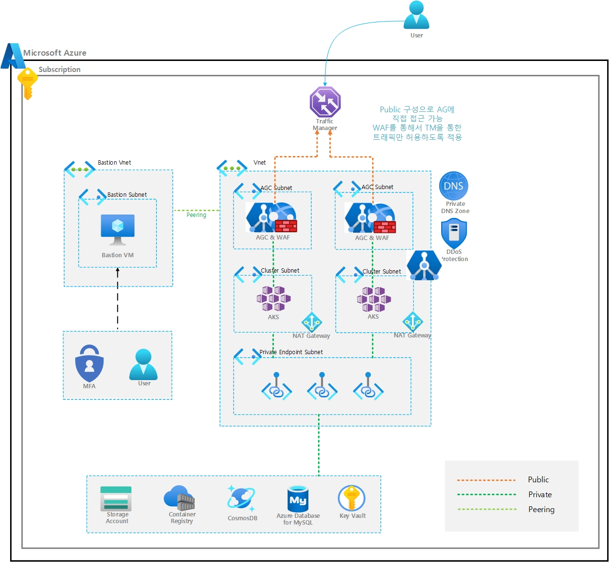

# Azure Infrastructure with Terraform


## Requirements

1. ### Versions

- terraform : 1.11.3 (>= 1.10.0)
- azurerm : 4.27.0 (>= 4.20.0)
- azapi : 2.3.0 (>= 2.0.1)
- random : 3.6.3 (>= 3.6.0)
- null : 3.2.3 (>= 3.2.0)
- naming : 0.4.2 (>= 0.4.0)

2. ### Azure 권한

- Owner (구독 범위)
- Storage Account 에 Entra ID 인증 사용 시(= Access Key 인증 미사용 시)
    - Storage Blob Data Contributor (구독 범위)
    - Storage Queue Data Contributor (구독 범위)


## Provider 및 Modules

- **azurerm**  
    Azure Resource Manager(Azure RM) provider로, Azure의 대부분 리소스(가상머신, 네트워크, 스토리지 등)를 관리할 수 있습니다.

    tenant_id, subscription_id : Azure 계정 정보 지정 필요
    ```terraform
    tenant_id           = "" // Entra 테넌트 ID
    subscription_id     = "" // Azure 구독 ID
    ```

- **azapi**

    Azure API provider로, azurerm에서 지원하지 않는 Azure 리소스나 프리뷰 기능을 사용할 때 활용합니다.

    사용 리소스 : MySQL Flexible Server(databasePort 설정), AKS(Virtual Machine Node Pool 설정)

- **random**

    무작위 문자열, 숫자 등 랜덤 값을 생성할 때 사용합니다.

    사용 리소스 : Traffic Manager (Relative Name 설정)

- **null**

    커맨드 실행, 의존성 관리 등에 사용합니다.
    사용 리소스 : Virtual Machine OS Disk 의 Disk Access 관련 설정 전 VM Provisioning 상태 체크

- **module "naming"**

    Azure 에서 제공하는 네이밍 모듈로, Azure 리소스의 이름을 자동 생성해줍니다.
    
    [Azure/naming/module](https://registry.terraform.io/modules/Azure/naming/azurerm/latest)

    [Azure 명명 규칙 정의](https://learn.microsoft.com/ko-kr/azure/cloud-adoption-framework/ready/azure-best-practices/resource-naming)

    사용 예시
    ```terraform
    module "naming" {
        source = "Azure/naming/azurerm"
        version = "0.4.2"
        prefix = ["${var.naming.prefix}", "${var.naming.env}", "${var.naming.location}"] 
        suffix = ["suffix"]
    }

    # var.naming.prefix = "prefix" var.naming.env = "prd", var.naming.location = "krc"
    # module.naming.virtual_machine.name = "prefix-prd-krc-vm-suffix" (배포되는 VM Name)
    # module.naming.application_gateway.name = "prefix-prd-krc-agw-suffix" (배포되는 AppGW Name)
    ```

## 파일 설명

폴더에서 사용되는 파일들은 다음과 같습니다.

- `main.tf` : 용도별 리소스 그룹 생성 및 Activity Log 진단 설정 구성
- `variables.tf` : 리소스별 네이밍, 리전, VNet, 서브넷, Application Load Balancer(AGC), Cosmos DB, Key Vault, VM, MySQL, Allow IP, Storage, 태그 등 변수 정의
- `provider.tf` : Azure 공급자 및 네이밍 모듈 선언, 변수 활용 리소스 배포 기반 설정
- `terraform.tfvars` : 네이밍, 리전, 네트워크, 서브넷, 리소스 스펙, 인증 정보, Bastion VM 접근 허용 IP 등 변수 값 정의(환경에 맞게 변수 값 수정)
- `azurerm_application_gateway_for_container.tf` :  배포용 두 개의 Application Gateway for Containers 생성 및 서비스 서브넷 연결
- `azurerm_container_registry.tf` : 프리미엄 ACR 생성, 퍼블릭 접근 차단, Private Endpoint 및 Private DNS를 통한 내부 접근 구성
- `azurerm_cosmosdb_account.tf` : Cosmos DB 계정 생성과 보안, 네트워크, 모니터링 리소스 구성
- `azurerm_key_vault.tf` : Key Vault를 내부 네트워크 전용으로 배포하기 위한 Private Endpoint, DNS, VNet 링크 등 구성
- `azurerm_kubernetes_cluster.tf` : Blue/Green AKS 클러스터, 서브넷, Private DNS, 관리 ID, 모니터링 및 진단 설정
- `azurerm_linux_virtual_machine.tf` : Bastion 역할 Linux VM과 네트워크, 보안, 모니터링, 확장 구성.
- `azurerm_log_analytics_workspace.tf` : 로그 분석 및 저장을 위한 Log Analytics Workspace, Storage Private Endpoint, DNS 및 네트워크 링크 구성.
- `azurerm_monitor_alert_prometheus_rule_group.tf` : AKS 모니터링 및 Prometheus 기반 알림 규칙 그룹 정의 
- `azurerm_monitor_workspace.tf` : AKS Prometheus 모니터링용 Azure Monitor Workspace, Managed Grafana, DCE/DCR 구성
- `azurerm_mysql_flexible_server.tf` : MySQL Flexible Server와 네트워크, 보안, 모니터링, 설정을 통합 정의(azapi provider 사용)
- `azurerm_nat_gateway.tf` : Blue/Green 환경 서비스 서브넷별 NAT Gateway와 Public IP 생성 및 연결.
- `azurerm_network_security_rule.tf` : NSG 인바운드/아웃바운드 규칙 보안 정책 
- `azurerm_storage_account.tf` : 스토리지 계정, Blob 서비스 Private Endpoint, DNS, 진단 설정 구성.
- `azurerm_traffic_manager_profile.tf` : Traffic Manager Profile 생성, Public IP 등록, Weighted 기반 트래픽 분산 및 상태 모니터링 구성
- `azurerm_virtual_network.tf` : 다양한 네트워크 인프라(vWAN, VNet, 서브넷, 피어링, DDoS 보호, NSG, Flow Log) 배포 및 NSG 연결 구성
- `Resource_Providers.csv` : 필요한 Azure 리소스 공급자


## 배포 방법

1. **Terraform 설치**  
     [Install Terraform](https://developer.hashicorp.com/terraform/tutorials/aws-get-started/install-cli)
     
2. **git 설치**
    [Install Git](https://git-scm.com/downloads)

3. **Azure CLI 로그인**
    
    [Azure CLI를 설치하는 방법](https://learn.microsoft.com/ko-kr/cli/azure/install-azure-cli)
     
      ```sh
      # Azure 계정으로 CLI에 로그인합니다. 브라우저가 열리며 로그인 화면으로 이동합니다.
      az login

      # 특정 테넌트 지정 로그인
      # 여러 테넌트를 가진 계정이라면, 특정 테넌트를 명시해서 로그인할 수 있습니다.
      az login --tenant <TENANT_ID>

      # 사용 가능한 모든 구독 확인
      # 로그인한 계정에서 접근 가능한 구독 목록을 확인합니다.
      # --all 옵션으로 모든 구독 표시, --output table로 보기 좋게 출력합니다.
      az account list --all --output table

      # 원하는 구독 선택
      # 작업할 구독을 선택합니다. 구독 이름 또는 ID를 사용할 수 있습니다.
      az account set --subscription "<Subscription Name or ID>"

      # 현재 활성 구독 확인
      # 선택한 구독이 정상적으로 활성화되었는지 확인합니다.
      az account show --output table
      ```
      
4. **작업 폴더 이동 및 변수 파일 작성**  
     ```sh
     # 접근하는 Tenant 및 Subscription ID 수정 - providers.tf 
        provider "azurerm" {
            features 
            {
            }
                tenant_id           = "" // Entra 테넌트 ID
                subscription_id     = "" // Azure 구독 ID
        }
     
     # 환경에 맞게 terraform.tfvars 수정

        naming = {
          prefix   = "prefix"       # 모든 리소스 네이밍에 접두어로 사용. 프로젝트 또는 회사 식별용으로 주로 사용
          env      = "prd"          # 환경 구분(예: 개발(dev), 스테이징(stg), 운영(prd))을 지정. 네이밍 및 리소스 태그에 활용
          location = "krc"          # 리소스 네이밍에 들어갈 지역 코드. 실제 Azure 리전명과 다를 수 있으니 네이밍 규칙으로 사용
        }
     ```

5. **Terraform 초기화 및 배포**  
     ```sh
     terraform init
     terraform plan
     terraform apply
     ```

6. **Terraform 리소스 삭제
     ```sh
     terraform destroy
     ```


## 특이사항


- 필요가 없는 리소스라면 해당되는 파일을 제거 후 `terraform apply` 를 진행하시면 됩니다.
- Storage Account 인증 관련
    - Entra ID 인증 또는 Access Key 인증 여부에 따라 terraform.tfvars 파일에서 storage 부분 수정이 필요합니다.
    - `shared_access_key_enabled = true or false`

        ```
        storage = {
            account_tier              = "Standard"
            account_replication_type  = "LRS"
            shared_access_key_enabled = false // 공유 액세스 키 사용 여부 True : Access Key 사용, False : Entra ID 인증 사용
        }
        ```

## Terraform 배포 전 구독에 기능 활성화가 필요합니다.

  **실행 방법**
  1. Azure CLI 로그인
      ```
      az login
      ```

  2. 기능 등록
  
      Private Application Gateway를 배포하려면 `EnableApplicationGatewayNetworkIsolation` 기능을 등록해야 합니다.
      ```
      az feature register --name EnableApplicationGatewayNetworkIsolation --namespace Microsoft.Network
      ```
      
      VM/VMSS에서 호스트 암호화를 사용하기 위해서는 `EnableApplicationGatewayNetworkIsolation` 기능을 등록해야 합니다.
      ```
      az feature register --name EncryptionAtHost --namespace Microsoft.Compute 
      ```
  
  3. 등록 상태 확인
      기능 등록은 즉시 완료되지 않고 몇 분 정도 소요될 수 있습니다.
      아래 명령어로 등록 상태를 확인할 수 있습니다.
      ```
      az feature show --name EnableApplicationGatewayNetworkIsolation --namespace Microsoft.Network
      ```
      ```
      az feature show --name EncryptionAtHost --namespace Microsoft.Compute
      ```

## 배포 전 참고 사항

**DDOS 프로텍터**, **vWAN**, **Activity Log 진단 설정**, **Application Gateway의 Manual 모드**는 기본적으로 주석 처리되어 있어 배포되지 않습니다.  
배포가 필요한 경우, 아래 사항을 확인 후 주석(`#`)을 제거하세요.

- **DDOS 프로텍터**  
  - 구독당 **1개만 생성 가능**하므로 이미 배포된 경우 주석을 제거하지 마세요.
  - **DDoS 프로텍터**가 이미 구독에 배포된 상태라면, 두 번째 테라폼 세트부터는 ""DDoS 프로텍터를"" vNet에서 **수동 연결"이 필요합니다.
- **vWAN**  
  - 배포 시간이 오래 걸리는 리소스이므로 기본적으로 주석 처리되어 있습니다.
- **Activity Log 진단 설정**  
  - 구독당 **최대 5개까지 생성 가능**하므로 필요한 경우에만 배포하세요.  
  - **Terraform destroy로는 삭제되지 않으므로**, 삭제가 필요할 경우 **Azure Portal에서 직접 삭제**해야 합니다.
- **Application Gateway의 Manual 모드**
  - 기본적으로 Autoscale이 활성화되어 있고, Manual 모드로 변경할 경우에는 주석 처리가 필요합니다.
> 절차는 아래를 참고하세요.

---

### 1. DDoS 프로텍터

**배포 방법 (코드 주석 제거)**
1. azurerm_virtual_network.tf 파일 열기
2. 아래 블록들 주석(#) 제거 후 저장
    ```
    resource "azurerm_network_ddos_protection_plan" "service" {
      name                = upper("${module.naming.network_ddos_protection_plan.name}") 
      location            = azurerm_resource_group.network.location                   
      resource_group_name = azurerm_resource_group.network.name        
      tags = var.tags
    }
    ```
    ```
    ddos_protection_plan {
      enable = true
      id     = azurerm_network_ddos_protection_plan.service.id
    }
    ```

**DDoS 프로텍터 수동 연결 방법**

1. Azure Portal에서 가상 네트워크(Virtual Network) 검색
2. 연결할 대상 가상 네트워크 클릭
3. 좌측 메뉴에서 설정(Settings) → DDoS 보호(DDoS protection) 선택
4. DDoS 네트워크 보호 사용 활성화 → DDoS 보호 계획 선택 → 저장
---

### 2. vWAN

**주석 처리 이유**
- **배포 시간이 오래 걸리는 리소스이므로 주석처리되어있습니다.

**배포 방법 (코드 주석 제거)**
1. azurerm_virtual_network.tf 파일 열기
2. 아래 블록 주석(#) 제거 후 저장

    ```
    resource "azurerm_virtual_wan" "vwan" {
      name                = upper("${module.naming.virtual_wan.name}") 
      location            = azurerm_resource_group.network.location  
      resource_group_name = azurerm_resource_group.network.name
      tags = var.tags 
    }
    ```
    
    ```
    resource "azurerm_virtual_hub" "vhub" {
      name                = upper("${module.naming.virtual_wan.name}-hub")
      location            = azurerm_resource_group.network.location        
      resource_group_name = azurerm_resource_group.network.name   
      virtual_wan_id      = azurerm_virtual_wan.vwan.id                    
      address_prefix      = var.vhub.address_prefix                       
      tags = var.tags
    }
    ```

    ```
    resource "azurerm_virtual_hub_connection" "service" {
      for_each = {
          service = azurerm_virtual_network.service 
          bastion = azurerm_virtual_network.bastion 
      }
      name                      = upper("conn-to-${each.value.name}") 
      virtual_hub_id            = azurerm_virtual_hub.vhub.id         
      remote_virtual_network_id = each.value.id                       
    }
    ```

### 3. Activity Log 진단 설정

**배포 방법 (코드 주석 제거)**
1. main.tf 파일 열기
2. 아래 블록 주석(#) 제거 후 저장

    ```
    resource "azurerm_monitor_diagnostic_setting" "activity_log" {
      name                       = lower("activity-log-${var.naming.prefix}-${data.azurerm_subscription.current.display_name}")
      target_resource_id         = data.azurerm_subscription.current.id
      storage_account_id         = azurerm_storage_account.log_storage.id
      log_analytics_workspace_id = azurerm_log_analytics_workspace.log.id

      enabled_log {
        category = "Administrative"
      }

      enabled_log {
        category = "Security"
      }

      enabled_log {
        category = "Policy"
      }

      enabled_log {
        category = "ServiceHealth"
      }

      enabled_log {
        category = "Alert"
      }

      enabled_log {
        category = "Recommendation"
      }

      enabled_log {
        category = "Autoscale"
      }

      enabled_log {
        category = "ResourceHealth"
      }
    }
    ```

**Azure Portal에서 Activity Log 삭제 방법**
1. Azure Portal에 로그인 후 모니터링(Monitor) 검색
2. 좌측 메뉴에서 활동 로그(Activity Log) → 진단 설정(Diagnostic settings) 선택
3. 삭제할 구독 선택
4. 삭제할 **대상 진단 설정의 설정 편집** 클릭 → 삭제
